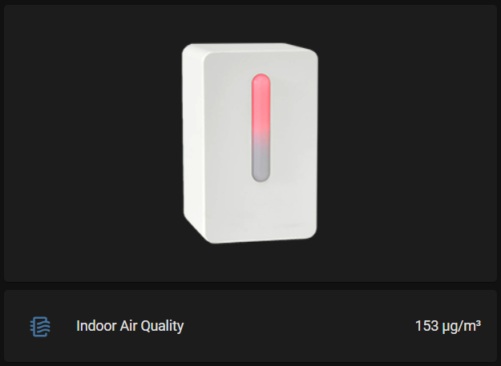

# Vindriktning-Card
Vindriktning Lovelace Card for Home Assistant


# Card
Create a Custom Card and paste this into the 'Code Editor'.<br/>
You'll need to modify the entity names below to match yours.
````
type: vertical-stack
cards:
  - type: picture-entity
    entity: sensor.vindriktning_color
    show_name: false
    show_state: false
    state_image:
      green: /local/AQI-green.png
      yellow: /local/AQI-yellow.png
      red: /local/AQI-red.png
  - type: entities
    entities:
      - entity: sensor.air_quality_index_vindriktning_pm2_5
        name: Indoor Air Quality
    show_header_toggle: false
    state_color: false
````

Copy the images in 'wwww' to your config/www directory.


## :camera: Screenshot



# References
https://www.ikea.com/us/en/p/vindriktning-air-quality-sensor-60515911/

https://community.home-assistant.io/t/ikea-vindriktning-air-quality-sensor/324599/187

https://blakadder.com/vindriktning-tasmota/